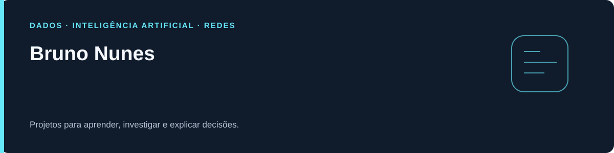

# Bruno Nunes



> Curiosidade para aprender. Cuidado para investigar. Projetos para construir experiência.

Sou formado em **Redes de Computadores desde 2017** e estudante de **Inteligência Artificial e Machine Learning**. Estou retomando redes e cibersegurança por meio de laboratórios práticos, enquanto construo projetos em dados, engenharia de dados e IA.

O visual Green Hat representa meu momento de aprendizado: estudar, testar em laboratório e explicar o que consegui descobrir.

[**LinkedIn**](https://www.linkedin.com/in/bruno-dsnunes/) · [**E-mail**](mailto:brdsnunes@gmail.com) · [**Todos os repositórios**](https://github.com/bruno-dsn?tab=repositories)

## 🛡️ NetGuard Lab — comece por aqui

**Um laboratório para entender logs e organizar os primeiros ajustes de segurança.**

[**▶ Abrir o aplicativo**](https://netguard-lab.brdsnunes.chatgpt.site) · [**⌘ Ver o código e o README**](https://github.com/bruno-dsn/bruno-dsn/tree/netguard-lab) · [**↓ Baixar o ZIP**](https://github.com/bruno-dsn/bruno-dsn/archive/refs/heads/netguard-lab.zip)

| Quero aprender a… | Onde começar |
| --- | --- |
| Ler um registro sem experiência | **Ler um log** — campos e explicações em linguagem simples |
| Investigar um relato | **Investigar** — linha do tempo, sinais, alternativas e caderno |
| Revisar Wi-Fi e roteador | **Redes → Wi-Fi e roteador** — seis pontos com evidências |
| Conhecer ferramentas | **Redes → Praticar com ferramentas** — Packet Tracer, Wireshark, Nmap e Wazuh |
| Organizar os próximos ajustes | **Proteção inicial**, **Inventário** e **Meu plano** |

O aplicativo pode ser aberto pelos colegas pelo link. Arquivos e notas da edição web ficam na memória do navegador; exporte para continuar depois.

**Onde está no GitHub?** O código está na branch `netguard-lab` deste repositório de perfil. Ainda não é um repositório independente na aba Repositories. Use o link **Ver o código** acima ou troque `main` por `netguard-lab` no seletor de branches.

## 🌐 Rede em Movimento — aprenda construindo

**Um projeto separado do NetGuard para reaprender redes com desenhos e prática.** A primeira versão acompanha o caminho de uma requisição ao abrir um site em 12 etapas, explora as sete camadas OSI e propõe desafios de cabo, gateway e DNS.

[**▶ Prévia do autor**](https://rede-em-movimento.brdsnunes.chatgpt.site) · [**⌘ Ver o código e o README**](https://github.com/bruno-dsn/bruno-dsn/tree/rede-em-movimento) · [**↓ Baixar o ZIP**](https://github.com/bruno-dsn/bruno-dsn/archive/refs/heads/rede-em-movimento.zip)

A prévia está publicada com acesso privado do autor. O código é público e pode ser executado localmente pelos colegas. Ele está na branch `rede-em-movimento` deste repositório de perfil; a criação de um repositório independente continua pendente.

## 🧩 Explore meus outros projetos

| Projeto | O que você pode explorar |
| --- | --- |
| [Lab Bricks](https://github.com/bruno-dsn/lab-bricks) | Escola prática de dados e Databricks, exercícios, SQL, BI, ML e IA com evidências |
| [VolunTech](https://github.com/bruno-dsn/VolunTech-FAM) | Gestão acadêmica de voluntariado, operações e laboratório SQL |
| [SQL sem Mistério](https://github.com/bruno-dsn/sql-guia-visual) | Consultas explicadas, tabelas visíveis e desafios para começar em SQL |
| [Qualidade e automação](https://github.com/bruno-dsn/Automacao-de-Tarefas) | Validação de catálogo, fila de execução e logs em ambiente local |
| [Retenção de clientes](https://github.com/bruno-dsn/analise-cancelamentos) | Segmentos, classificação e cenários de campanha com dados sintéticos |
| [Risco de crédito](https://github.com/bruno-dsn/credit-score-prediction-ml) | Simulação em reais, parcelas e avaliação de um modelo educacional |
| [Métricas de ML](https://github.com/bruno-dsn/ml-metrics-calculator) | Classificação, regressão e efeito dos limiares nas decisões |
| [Demanda, preço e margem](https://github.com/bruno-dsn/ecommerce-analise-graficos) | Conversão, rentabilidade e cenários no varejo digital |
| [Abandono escolar](https://github.com/bruno-dsn/analise-evasao-escolar) | Comparações territoriais com dados públicos do Inep |
| [Reforma Tributária](https://github.com/bruno-dsn/reforma-tributaria-2026) | Fontes legais, transição e simulações educacionais |
| [Painel B3](https://github.com/bruno-dsn/painel-precos-acoes) | Retorno, volatilidade, drawdown e correlação com fonte identificada |


## 🟢 Meu jeito de aprender

```text
observar → formular uma hipótese → testar → registrar → explicar
```

Cada README explica o problema, a origem dos dados, como executar e os limites do resultado. Identifico dados sintéticos e separo os resultados de laboratório de experiência profissional ou validação em produção.

As tecnologias dos projetos incluem **Python, SQL, pandas, scikit-learn, Streamlit, TypeScript e React**. O Lab Bricks também contém práticas para uma conta Databricks, cuja validação nativa é registrada separadamente dos testes locais.

## 📚 Referências de estudo

Também mantenho forks de [REA](https://github.com/bruno-dsn/rea) e [Vibe Coding Toolkit](https://github.com/bruno-dsn/vibe-coding-toolkit). São projetos de outros autores que uso para estudar; os créditos e as licenças estão nos respectivos repositórios.

Estou aberto a oportunidades de início de carreira em dados e tecnologia. Você pode falar comigo pelo [LinkedIn](https://www.linkedin.com/in/bruno-dsnunes/) ou por [e-mail](mailto:brdsnunes@gmail.com).

[**Ponto de retomada do nosso trabalho**](https://github.com/bruno-dsn/bruno-dsn/blob/netguard-lab/docs/CONTINUIDADE.md) · [Apoiar meus estudos](https://buymeacoffee.com/brunonunes)
