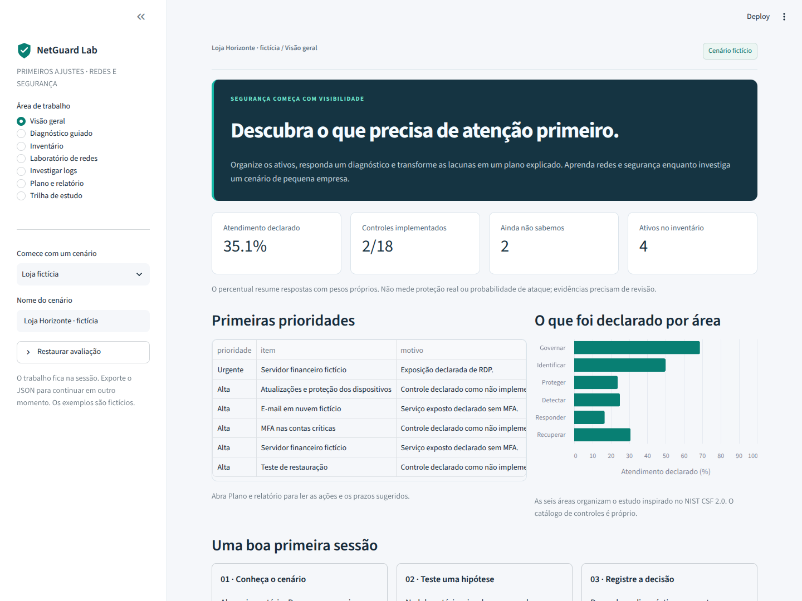
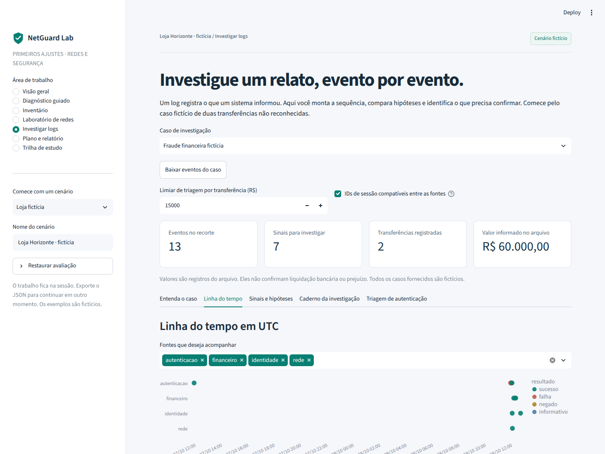

# NetGuard Lab

**Primeiros ajustes de segurança, revisão de redes e investigação de logs para quem está começando.**



Uma pequena empresa sabe que precisa se proteger, mas nem sempre sabe por onde começar. Este laboratório transforma um inventário e 18 perguntas em um plano explicado. Um caso fictício de fraude financeira ensina a organizar registros, testar hipóteses e propor contenção a partir de evidências.

[Começar](#executar-localmente) · [Investigar um caso](docs/INVESTIGACAO_DE_LOGS.md) · [Entender o método](docs/METODOLOGIA.md) · [Trilha de quatro semanas](docs/TRILHA_DE_ESTUDO.md)

## O que dá para fazer

| Área | Experiência |
| --- | --- |
| Diagnóstico | Responder 18 controles, registrar evidências e distinguir lacunas de informações desconhecidas |
| Inventário | Editar ativos ou importar CSV; revisar exposição, MFA, atualização e restauração declaradas |
| Redes | Calcular IPv4 e IPv6, verificar sobreposição e simular uma política de acesso com negação padrão |
| Investigação | Organizar eventos em UTC, filtrar fontes e ler sinais com IDs, hipóteses e explicações alternativas |
| Caderno | Registrar observações, dúvidas e contenção proposta; exportar JSON com a identificação do arquivo |
| Plano | Exportar a avaliação em JSON, o plano em CSV e um relatório HTML que pode ser impresso |

O aplicativo funciona localmente com cenários sintéticos. As regras são explícitas e não usam IA. Os relatórios organizam declarações; a aplicação não conecta equipamentos nem executa alterações em uma empresa.

## Seu primeiro caso de logs

Em **Investigar logs**, abra **Fraude financeira fictícia**. A loja de exemplo relata duas operações não reconhecidas. Há 13 eventos de autenticação, identidade, rede e financeiro; duas transferências somam R$ 60 mil nos registros.

1. Abra **Linha do tempo** e localize E007, E008, E010, E011 e E012.
2. Em **Sinais e hipóteses**, compare a observação com a explicação alternativa.
3. No **Caderno da investigação**, anote o que precisa confirmar com identidade e financeiro.
4. Proponha uma ação com responsável e validação. Exporte o caderno e a linha do tempo.
5. Troque para o **Caso benigno fictício**: um login legítimo após falhas ainda pode gerar um sinal.

O exemplo declara que os sistemas compartilham IDs de sessão. Em um CSV próprio, a correlação entre fontes só é ativada após você confirmar essa compatibilidade. O IP ou a proximidade temporal, sozinhos, não estabelecem vínculo.



O registro de uma conexão em RDP justifica uma verificação, mas não determina a porta de entrada da fraude. Os valores no arquivo também não comprovam liquidação bancária ou prejuízo. O [guia de investigação](docs/INVESTIGACAO_DE_LOGS.md) explica essas perguntas.

## Executar localmente

O código inicial está na branch `netguard-lab` do repositório de perfil. [Baixe o ZIP](https://github.com/bruno-dsn/bruno-dsn/archive/refs/heads/netguard-lab.zip) ou clone somente essa branch:

```bash
git clone --branch netguard-lab --single-branch https://github.com/bruno-dsn/bruno-dsn.git netguard-lab
cd netguard-lab
```

Requer **Python 3.12 ou superior**. Abra a pasta do projeto no terminal:

```bash
python -m venv .venv
```

Ative o ambiente:

```bash
# Linux/macOS
source .venv/bin/activate

# Windows PowerShell
.venv\Scripts\Activate.ps1
```

Instale e execute:

```bash
python -m pip install -r requirements.txt
python -m streamlit run app.py --server.address 127.0.0.1
```

Abra o endereço local informado pelo Streamlit. Comece pela loja fictícia; depois escolha **Avaliação em branco** para preencher seu próprio exercício. Respostas e anotações ficam na sessão: exporte os arquivos antes de fechar o trabalho. O JSON da avaliação restaura diagnóstico e inventário; o caderno de logs tem exportação própria.

### Relatório pela linha de comando

```bash
python avaliar.py --avaliacao data/cenario-loja.json --saida reports/loja
```

Isso gera `reports/loja.html` e `reports/loja.csv` sem abrir o aplicativo.

## Formatos de entrada

| Arquivo | Exemplo | Limite |
| --- | --- | --- |
| Avaliação JSON | [Loja](data/cenario-loja.json) | 2 MB; versão de esquema 1; chaves e estados validados |
| Inventário CSV | [Inventário](data/inventario-exemplo.csv) | 2 MB; até 500 ativos; IDs únicos |
| Eventos CSV | [Caso financeiro](data/caso-financeiro-ficticio.csv) | 2 MB; até 10 mil eventos; IDs únicos e horários com fuso |
| Autenticação CSV | [Log de autenticação](data/log-autenticacao-exemplo.csv) | 2 MB; até 10 mil eventos; usuário, IP e resultado |

Use UTF-8 e as colunas exatas dos exemplos. Valores financeiros usam ponto decimal, como `15000.00`, e precisão de centavos. IPv4 e IPv6 são aceitos. O parser normaliza horários em UTC e calcula o SHA-256 dos bytes recebidos; isso identifica a cópia recebida, sem comprovar sua autenticidade histórica.

## Como interpretar o resultado

**Atendimento declarado** é uma média ponderada das respostas, com pesos próprios. Não se aplica exige justificativa e sai do cálculo; se tudo for excluído, não há percentual. Não sei aparece separado e gera uma tarefa para confirmar informação. Uma resposta implementada sem nota gera uma tarefa de evidência.

O catálogo organiza o estudo pelas seis funções do NIST CSF 2.0. Ele não reproduz uma auditoria oficial, não mede probabilidade de ataque e não garante proteção. Os sinais de logs ajudam a formular perguntas e podem produzir falsos positivos. Leia a [metodologia](docs/METODOLOGIA.md).

## Verificar uma mudança

```bash
python -m pip install -r requirements-dev.txt
python -m ruff check .
python -m pytest
```

Os testes verificam cálculos e limites de sub-redes, negação padrão, entradas inválidas, escape de relatórios, precisão financeira, janelas temporais, sessões distintas, falsos positivos e navegação do aplicativo. O workflow executa essas verificações em Python 3.12 e 3.13.

## Organização

```text
app.py                    aplicação Streamlit
avaliar.py                relatório pela linha de comando
src/netguard/             regras independentes da interface
data/                     cenários e registros fictícios
docs/                     método, investigação e trilha de estudo
tests/                    testes de regras e fluxos
```

## Próximas experiências

- Adaptadores para formatos específicos de logs, mantendo validação e origem dos campos.
- Exercício de coleta e retenção de logs em uma máquina de laboratório.
- Comparação entre uma regra explicável e detecção de anomalias, com avaliação temporal e medição de falsos positivos.

Esses itens são propostas futuras. A versão atual faz ingestão de arquivos e análise local; não é um coletor de produção ou um SIEM.

## Referências e autoria

- [NIST SP 1300 — guia de início para pequenas empresas](https://www.nist.gov/publications/nist-cybersecurity-framework-20-small-business-quick-start-guide).
- [NIST SP 800-61 Rev. 3 — resposta a incidentes](https://csrc.nist.gov/pubs/sp/800/61/r3/final).
- [NIST SP 800-92 — fundamentos de gestão de logs](https://csrc.nist.gov/pubs/sp/800/92/final).
- [CISA Secure Our World](https://www.cisa.gov/secure-our-world).

Projeto educacional de **Bruno Nunes**. Controles, pesos, regras e casos são próprios. Sem afiliação ou certificação das instituições citadas. Licença [MIT](LICENSE).

